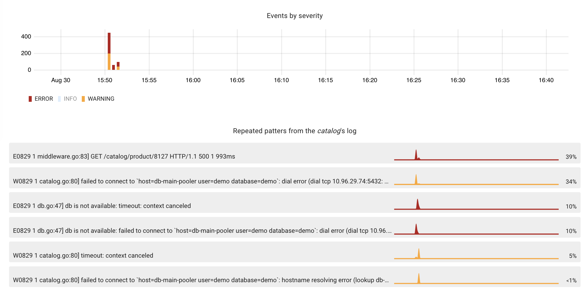
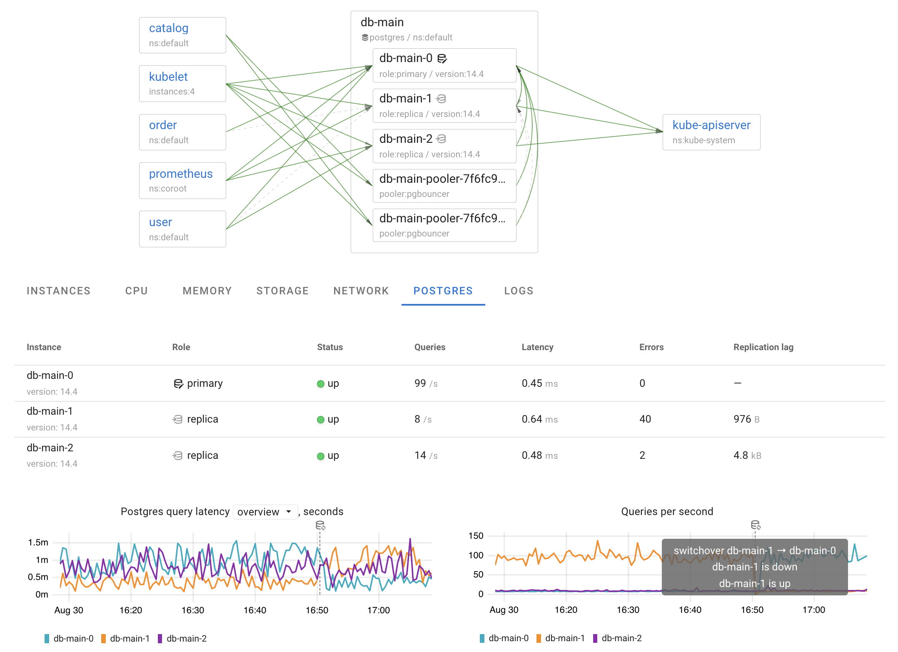

Coroot is a monitoring and troubleshooting tool for microservice architectures. 

### [Features](#features) | [Installation](https://coroot.com/docs/coroot-community-edition/getting-started/installation) | [Documentation](https://coroot.com/docs/coroot-community-edition/) | [Community & Support](#community--support) | [Live demo](https://community-demo.coroot.com/)

## Features

### eBPF-based service mapping
Thanks to eBPF, Coroot shows you a comprehensive [map of your services](https://coroot.com/blog/building-a-service-map-using-ebpf) without any code changes.

The most popular L7 protocols are already supported:

* HTTP
* Postgres
* Mysql
* Mongodb
* Redis
* Memcached
* Cassandra
* Kafka

### Hassle-free SLO tracking

Coroot has predefined SLOs with universal thresholds for availability and latency, but you can easily adjust these thresholds for any app.

That's it! Configure the Slack integration, and you will be notified of any significant SLOs violation.

### Log analysis without storage costs

[Node-agent](https://github.com/coroot/coroot-node-agent) turns terabytes of logs into just a few dozen metrics by extracting 
[repeated patterns](https://coroot.com/blog/mining-logs-from-unstructured-logs) right on the node. 
Using these metrics allows you to quickly and cost-effectively find the errors relevant to a particular outage.

### Cloud topology awareness

Coroot uses [cloud metadata](https://coroot.com/blog/cloud-metadata) to show which regions and availability zones 
each application runs in.
This is very important to known, because:
 * Network latency between availability zones within the same region can be higher than within one particular zone.
 * Data transfer between availability zones in the same region is paid, while data transfer within a zone is free.

### Advanced Postgres observability
 
Coroot [makes](https://coroot.com/blog/pg-agent) troubleshooting Postgres-related issues easier not only for experienced DBAs but also for engineers not specialized in databases.

 

### Integration into your existing monitoring stack

Coroot uses Prometheus as a Time-Series Database (TSDB):
* The agents are Prometheus-compatible exporters 
* Coroot itself is a Prometheus client (like Grafana)

### Built-in Prometheus cache

The built-in Prometheus cache allows Coroot to provide you with a blazing fast UI without overloading your Prometheus.

## Installation

You can run Coroot as a Docker container or deploy it into any Kubernetes cluster.
Check out the [Installation guide](https://coroot.com/docs/coroot-community-edition/getting-started/installation).

## Documentation

The Coroot documentation is available at [coroot.com/docs/coroot-community-edition](https://coroot.com/docs/coroot-community-edition).

## Live demo

A live demo of Coroot is available at [community-demo.coroot.com](https://community-demo.coroot.com/)

## Community & Support

* [Community Slack](https://join.slack.com/t/coroot-community/shared_invite/zt-1gsnfo0wj-I~Zvtx5CAAb8vr~r~vecyw)
* [GitHub Discussions](https://github.com/coroot/coroot/discussions)
* [GitHub Issues](https://github.com/coroot/coroot/issues)
* Twitter: [@coroot_com](https://twitter.com/coroot_com)

## License

Coroot is licensed under the [Apache License, Version 2.0](https://github.com/coroot/coroot/blob/main/LICENSE).

