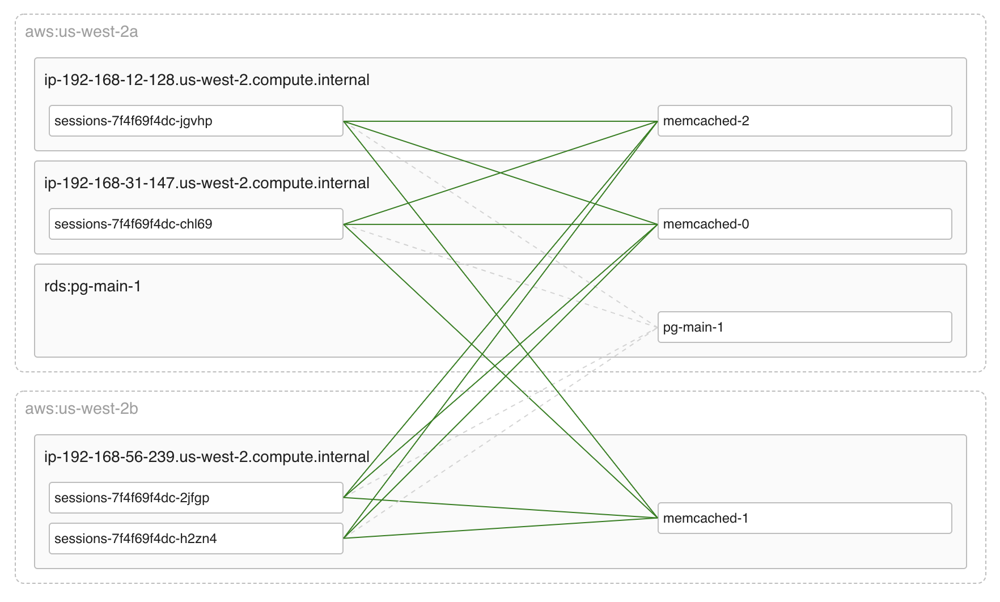
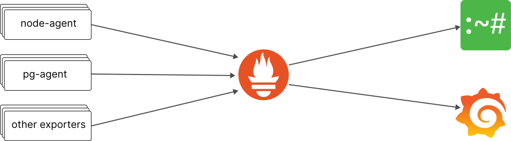

Coroot is a monitoring and troubleshooting tool for microservice architectures. 


[](https://opensource.org/licenses/Apache-2.0)

<p align="center"></p>


## Features

### eBPF-based service mapping
Thanks to eBPF, Coroot shows you a comprehensive [map of your services](https://coroot.com/blog/building-a-service-map-using-ebpf) without any code changes.

<p align="center"></p>

### Log analysis without storage costs

[Node-agent](https://github.com/coroot/coroot-node-agent) turns terabytes of logs into just a few dozen metrics by extracting 
[repeated patterns](https://coroot.com/blog/mining-logs-from-unstructured-logs) right on the node. 
Using these metrics allows you to quickly and cost-effectively find the errors relevant to a particular outage.

<p align="center"></p>

### Cloud topology awareness

Coroot uses [cloud metadata](https://coroot.com/blog/cloud-metadata) to show which regions and availability zones 
each application runs in.
It's very important to known, because:
 * Network latency between availability zones within the same region can be higher than within one particular zone.
 * Data transfer between availability zones in the same region is paid, while data transfer within a zone is free.

<p align="center"></p>

### Advanced Postgres observability
 
Coroot [makes](https://coroot.com/blog/pg-agent) troubleshooting Postgres-related issues easier not only for experienced DBAs but also for engineers not specialized in databases.

<p align="center"></p> 


### Integration into your existing monitoring stack

Coroot uses Prometheus as a Time-Series Databases (TSDB):
* The agents are Prometheus-compatible exporters 
* Coroot itself is a Prometheus client (like Grafana)

<p align="center"></p>

### Built-in Prometheus cache

The built-in Prometheus cache allows Coroot to provide you with a blazing fast UI and not overload your Prometheus.


## Quick start

### Kubernetes

Apply the manifest:

```bash
kubectl apply -f https://raw.githubusercontent.com/coroot/coroot/main/manifests/coroot.yaml
```

Forward the Coroot port to your machine:
```bash
kubectl port-forward -n coroot service/coroot 8080:8080
```

Then, you can access Coroot at http://localhost:8080/


### Docker

```bash
docker run -d --name coroot -p 8080:8080 ghcr.io/coroot/coroot 
```

Then, you can access Coroot at http://localhost:8080/

To view the Coroot's log, run:

```bash
docker logs -f coroot
```

To run Coroot on a different port:

```bash
docker run -d --name coroot -p <PORT>:8080 ghcr.io/coroot/coroot
```


## License

Coroot is licensed under the [Apache License, Version 2.0](https://github.com/coroot/coroot/blob/main/LICENSE).


